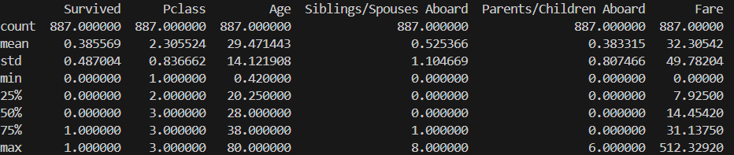
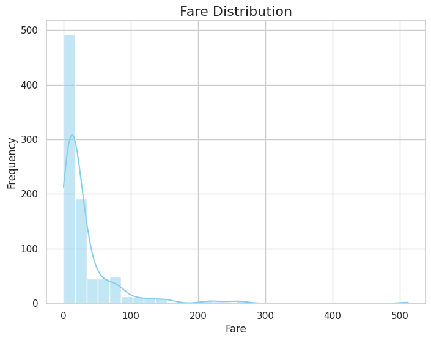
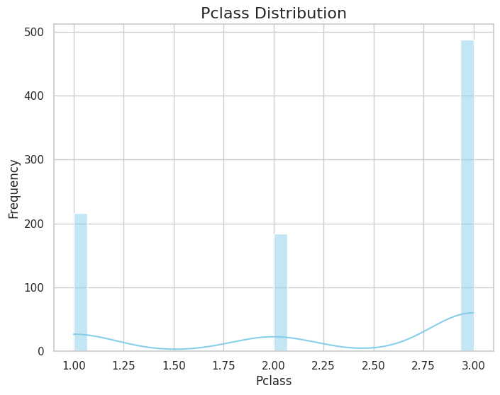

# Allen_Wang_miniproj_9

[](https://github.com/nogibjj/Allen_Wang_miniproj_9/actions/runs/11633910551)
[](https://github.com/nogibjj/Allen_Wang_miniproj_9/actions/runs/11633910608)
[](https://github.com/nogibjj/Allen_Wang_miniproj_9/actions/runs/11633910562)
[](https://github.com/nogibjj/Allen_Wang_miniproj_9/actions/runs/10936070182)

## Overview

This project demonstrates Continuous Integration (CI) and Continuous Deployment (CD) using GitHub Actions for a Python Data Science project, hosted on Google Colab for easy cloud access. The project uses Pandas and Polars for data analysis, nbval for notebook testing, and automated formatting and linting integrated within the CI/CD pipeline. It includes data manipulation tasks on a sample dataset, where the CI/CD pipeline automates testing, code quality checks, and deployment.

## Features
- **Descriptive Statistics**: Python script and Jupyter notebook that:
  - Reads a dataset (CSV or Excel).
  - Generates summary statistics including mean, median, and standard deviation for numeric columns.
  - Creates a histogram for data visualization.
  - Perform data transformation and manipulation (notebook only)
- **Automated Testing**:
  - Tested using `pytest` with the `nbval` plugin for notebook validation.
  - Unit tests for scripts and libraries.
- **CI/CD Pipeline**:
  - GitLab Actions run all Makefile commands with badges displayed in the README.
  - The pipeline includes testing, code formatting, packages installing, and linting.
    
## Project Structure

- **Jupyter Notebook and main.py**: 
  - Contains the main code for data analysis.
  - Executes descriptive statistics using Polars or Pandas.

- **Makefile**: Provides commands for setup, testing, and formatting:
  - `make install`: Installs project dependencies using `pip install -r requirements.txt`.
  - `make format`: Formats all Python code using Black.
  - `make lint`: Lints Python code using Ruff.
  - `make test`: Runs all tests including notebook and script testing.

- **test_script.py**: Unit tests for the Python script.

- **test_lib.py**: Unit tests for the project’s Python libraries.

- **requirements.txt**: Contains pinned dependencies required for the project.

- **GitLab CI**: Automates the following actions:
  - Runs all Makefile commands (install, test, lint, format).
  - Displays badges for each task in the README.

## Colab LInk 
https://colab.research.google.com/drive/1_G-xXOaFPY2p2jGRrd61uKnsmvjO8Wc0#scrollTo=e2C7qz_JBns1

## Setup

1. **Clone the repository:**

    ```bash
    git clone https://github.com/nogibjj/Allen_Wang_miniproj_9.git
    cd Allen_Wang_miniproj_9
    ```

2. **Install dependencies:**

    ```bash
    make install
    ```

3. **Format code:**

    ```bash
    make format
    ```

4. **Lint code:**

    ```bash
    make lint
    ```

5. **Test code:**

    ```bash
    make test
    ```

## Data Analysis Script

The Python script in `main.py` can perform the following:

### 1. **Read a Dataset**:
   It reads a dataset from a CSV or Excel file.

### 2. **Generate Summary Statistics**:
   For each numeric column, the script generates:
   - Mean
   - Median
   - Standard Deviation
    

### 3. **Data Visualization**:
   The script creates a histogram for the numeric columns in the dataset.
    
    
    
    


