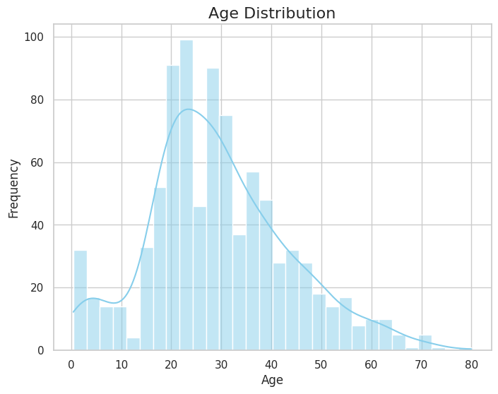

# Allen_Wang_Individualproj_1

[](https://github.com/nogibjj/Allen_Wang_Individualproj_1/actions/runs/10936070182)
[](https://github.com/nogibjj/Allen_Wang_Individualproj_1/actions/runs/10936070200)
[](https://github.com/nogibjj/Allen_Wang_Individualproj_1/actions/runs/10936070183)
[](https://github.com/nogibjj/Allen_Wang_Individualproj_1/actions/runs/10936070189)

## Overview

This project demonstrates Continuous Integration (CI) using GitLab Actions for a Python Data Science project. It features the use of Pandas for data analysis, nbval for notebook testing, and automated formatting and linting tools integrated into a GitLab CI pipeline. The project performs data analysis, testing, and code quality checks as part of the CI process.


## Features
- **Descriptive Statistics**: A Python script that:
  - Reads a dataset (CSV or Excel).
  - Generates summary statistics including mean, median, and standard deviation for numeric columns.
  - Creates a histogram for data visualization.
- **Automated Testing**:
  - Tested using `pytest` with the `nbval` plugin for notebook validation.
  - Unit tests for scripts and libraries.
- **CI/CD Pipeline**:
  - GitLab Actions run all Makefile commands with badges displayed in the README.
  - The pipeline includes testing, code formatting, packages installing, and linting.
    
## Project Structure

- **Jupyter Notebook and main.py**: 
  - Contains the main code for data analysis.
  - Executes descriptive statistics using Polars or Pandas.

- **Makefile**: Provides commands for setup, testing, and formatting:
  - `make install`: Installs project dependencies using `pip install -r requirements.txt`.
  - `make format`: Formats all Python code using Black.
  - `make lint`: Lints Python code using Ruff.
  - `make test`: Runs all tests including notebook and script testing.

- **test_script.py**: Unit tests for the Python script.

- **test_lib.py**: Unit tests for the project’s Python libraries.

- **requirements.txt**: Contains pinned dependencies required for the project.

- **GitLab CI**: Automates the following actions:
  - Runs all Makefile commands (install, test, lint, format).
  - Displays badges for each task in the README.

## Youtube Link 
https://www.youtube.com/watch?v=5DYYrVQYMWU

## Setup

1. **Clone the repository:**

    ```bash
    git clone https://github.com/nogibjj/Allen_Wang_miniproj_2.git
    cd Allen_Wang_miniproj_2
    ```

2. **Install dependencies:**

    ```bash
    make install
    ```

3. **Format code:**

    ```bash
    make format
    ```
    
4. **Lint code:**

    ```bash
    make lint
    ```
   
5. **Test code:**

    ```bash
    make test
    ```
   

## Data Analysis Script

The Python script in `main.py` can perform the following:

### 1. **Read a Dataset**:
   It reads a dataset from a CSV or Excel file.

### 2. **Generate Summary Statistics**:
   For each numeric column, the script generates:
   - Mean
   - Median
   - Standard Deviation
    

### 3. **Data Visualization**:
   The script creates a histogram for the numeric columns in the dataset.
    
    
    
    


