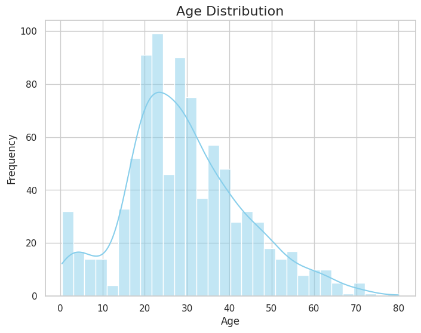
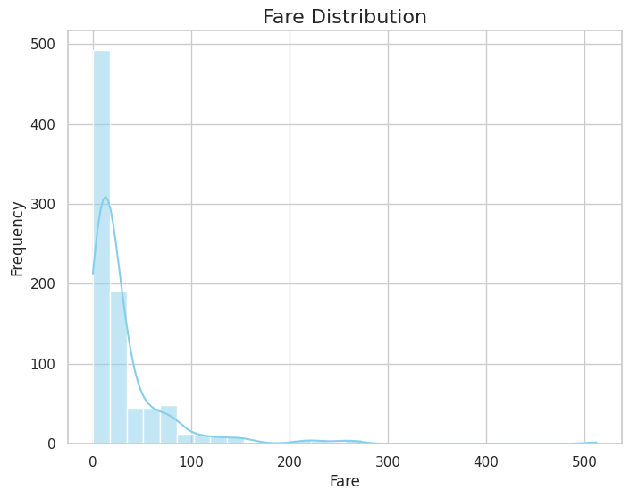
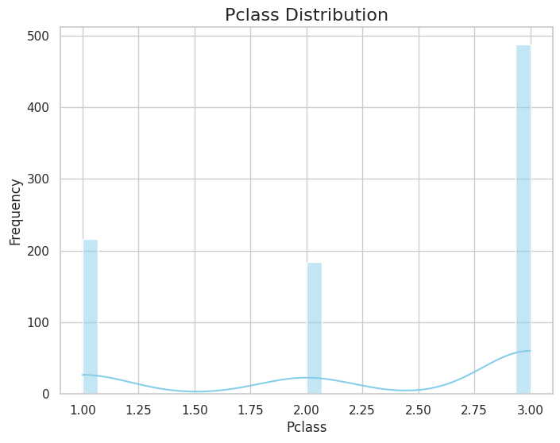

Summary:
|       |   Survived |     Pclass |      Age |   Siblings/Spouses Aboard |   Parents/Children Aboard |     Fare |
|:------|-----------:|-----------:|---------:|--------------------------:|--------------------------:|---------:|
| count | 887        | 887        | 887      |                887        |                887        | 887      |
| mean  |   0.385569 |   2.30552  |  29.4714 |                  0.525366 |                  0.383315 |  32.3054 |
| std   |   0.487004 |   0.836662 |  14.1219 |                  1.10467  |                  0.807466 |  49.782  |
| min   |   0        |   1        |   0.42   |                  0        |                  0        |   0      |
| 25%   |   0        |   2        |  20.25   |                  0        |                  0        |   7.925  |
| 50%   |   0        |   3        |  28      |                  0        |                  0        |  14.4542 |
| 75%   |   1        |   3        |  38      |                  1        |                  0        |  31.1375 |
| max   |   1        |   3        |  80      |                  8        |                  6        | 512.329  |

Mean:
|                         |         0 |
|:------------------------|----------:|
| Survived                |  0.385569 |
| Pclass                  |  2.30552  |
| Age                     | 29.4714   |
| Siblings/Spouses Aboard |  0.525366 |
| Parents/Children Aboard |  0.383315 |
| Fare                    | 32.3054   |

Median:
|                         |       0 |
|:------------------------|--------:|
| Survived                |  0      |
| Pclass                  |  3      |
| Age                     | 28      |
| Siblings/Spouses Aboard |  0      |
| Parents/Children Aboard |  0      |
| Fare                    | 14.4542 |

Standard Deviation:
|                         |         0 |
|:------------------------|----------:|
| Survived                |  0.487004 |
| Pclass                  |  0.836662 |
| Age                     | 14.1219   |
| Siblings/Spouses Aboard |  1.10467  |
| Parents/Children Aboard |  0.807466 |
| Fare                    | 49.782    |

